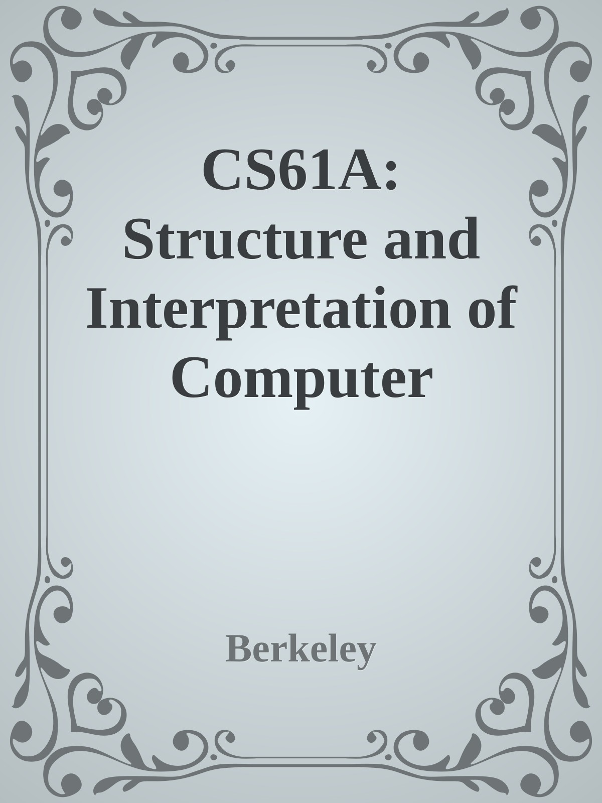

# CS61A

The default version *cs61a.epub* is made from pages in *www/*:



Generate epub version of CS61A textbook on command line:

```sh
ebook-convert index.html cs61a.epub \
	--cover=cover.jpg \
	--title='CS61A: SICP' \
	--authors='John DeNero' \
	--publisher='Berkeley' \
	--breadth-first \
	--dont-split-on-page-breaks \
	--use-auto-toc \
	--level1-toc="//*[name()='h1']" \
	--level2-toc="//*[name()='h2']" \
	--level3-toc="//*[name()='h3']" \
	--language=en \
	--pubdate=2019 -v \
	--comments="Composing Programs is authored and maintained by John DeNero. Please direct corrections and contributions directly to him via email. The text was originally published as lecture notes for CS 61A at UC Berkeley and is based upon the Structure and Interpretation of Computer Programs by Harold Abelson and Gerald Jay Sussman."
```

---

[Composing Programs](http://www.composingprograms.com/) might be the latest official version, but there are only 4 chapters, I've also made a epub book based on this version.

Open index.html with calibre, add meta and cover, then convert from zip to epub.

After that, use regular expression to remove header, footer... etc, and edit table of contents.
